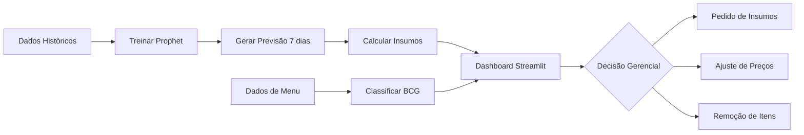

# 🍔 Burger-Flow Intelligence

**Sistema de Gestão Inteligente para Hamburguerias**

Plataforma que combina Análise Preditiva com Prophet e Engenharia de Menu (BCG) para maximizar lucro e reduzir desperdício em operações de food service.

---

## 🎯 Funcionalidades

### 1. Previsão de Demanda (Prophet)
- **Modelos de séries temporais** treinados para cada produto
- Previsão de vendas para os próximos 7 dias
- Intervalos de confiança (IC 95%) para gestão de risco
- **Sazonalidade automática**:
  - Semanal: Sexta/Sábado +50%, Domingo +20%
  - Mensal: Inverno +10%, Férias -15%

### 2. Gestão de Estoque Inteligente
- **Conversão automática** de vendas previstas em insumos necessários
- Lista de compras semanal em formato prático
- Cálculo por produto:
  - Burger Clássico: 150g carne, 1 pão, 30g queijo, etc.
  - Burger Gourmet: 200g carne, 50g queijo, 40g bacon, etc.
  - Batata Frita: 200g batata, 50ml óleo

### 3. Engenharia de Menu (Matriz BCG Adaptada)
Classificação automática de itens em 4 quadrantes:

| Quadrante | Características | Ação Recomendada |
|-----------|----------------|------------------|
| ⭐ **Estrela** | Alta Margem + Alto Volume | Manter destaque no cardápio |
| 🎯 **Oportunidade** | Alta Margem + Baixo Volume | Investir em marketing/promoções |
| 🐄 **Vaca Leiteira** | Baixa Margem + Alto Volume | Manter preço competitivo |
| 🐕 **Cão/Retirar** | Baixa Margem + Baixo Volume | Avaliar remoção do menu |

### 4. Simulador de Preços
- **Slider interativo** para testar impacto de ajustes de preço
- Recalcula margens e reclassifica quadrantes em tempo real
- Identifica produtos sensíveis a mudanças de preço

---

## 📊 Estrutura do Dashboard

### Tab 1: Gestão de Estoque
- Tabela de insumos necessários para a semana
- Gráfico de previsão com intervalos de confiança
- KPIs: Total de burgers e batatas previstas

### Tab 2: Engenharia de Menu
- Scatter plot BCG interativo com quadrantes coloridos
- Tabela detalhada com margem, volume e lucro por item
- Insights automáticos: Estrelas, Oportunidades e Cães

### Tab 3: Análise Histórica
- Vendas por dia da semana (identificação de padrões)
- Distribuição de vendas por produto (pizza chart)
- Série temporal dos últimos 90 dias

---

## 🚀 Como Usar

### 1. Gerar Dados Sintéticos
```bash
cd projeto-burger-flow
python src/gerar_dados_burger.py
```

**O que é gerado:**
- `data/vendas_burger.csv` — 2 anos de histórico (730 dias × 3 produtos)
- `data/menu_performance.csv` — 10 itens com custos, preços e volumes

### 2. Treinar Modelos e Prever Estoque
```bash
python src/previsao_estoque.py
```

**O que é gerado:**
- `models/prophet_*.pkl` — 3 modelos Prophet treinados
- `data/previsao_estoque.csv` — Previsão de 7 dias por produto
- `data/necessidade_insumos.csv` — Lista de compras automática

### 3. Executar Dashboard
```bash
# Via página específica
streamlit run pages/7_Burger_Flow_Intelligence.py

# Ou via homepage do hub
streamlit run streamlit_app.py
```

---

## 📁 Estrutura do Projeto

```
projeto-burger-flow/
├── requirements.txt          # Dependências (Prophet, Plotly, Pandas)
├── app/
│   └── burger_dashboard.py   # Dashboard principal com 3 tabs
├── data/
│   ├── vendas_burger.csv     # Histórico de 2 anos
│   ├── menu_performance.csv  # Performance do cardápio
│   ├── previsao_estoque.csv  # Previsões Prophet
│   └── necessidade_insumos.csv  # Lista de compras
├── models/
│   ├── prophet_burger_clássico.pkl
│   ├── prophet_burger_gourmet.pkl
│   └── prophet_batata_frita.pkl
└── src/
    ├── gerar_dados_burger.py    # Geração de dados sintéticos
    └── previsao_estoque.py      # Treino Prophet + cálculo de insumos
```

---

## 🔬 Detalhes Técnicos

### Sazonalidade Implementada
```python
# Fator dia da semana
Sexta/Sábado: 1.5x (+ 50%)
Domingo: 1.2x (+ 20%)
Segunda-Quinta: 1.0x (baseline)

# Fator mensal
Dezembro/Janeiro: 0.85x (- 15%, férias)
Junho/Julho: 1.10x (+ 10%, inverno = mais hambúrguer)
Outros meses: 1.0x
```

### Configuração Prophet
```python
Prophet(
    yearly_seasonality=True,      # Captura padrões anuais
    weekly_seasonality=True,       # Captura padrão semanal
    daily_seasonality=False,       # Não aplicável para vendas diárias
    interval_width=0.95,           # IC 95%
    seasonality_mode="multiplicative"  # Mais realista para vendas
)
```

### Classificação BCG
```python
# Thresholds baseados em medianas
mediana_volume = df["Volume_Vendas"].median()
mediana_margem = df["Margem_Percentual"].median()

# Matriz 2x2
if alta_margem and alto_volume: "Estrela"
if alta_margem and baixo_volume: "Oportunidade"
if baixa_margem and alto_volume: "Vaca Leiteira"
if baixa_margem and baixo_volume: "Cão"
```

---

## 💡 Casos de Uso Reais

### 1. Redução de Desperdício
- **Problema**: Excesso de insumos perecíveis (carne, alface, tomate)
- **Solução**: Previsão de demanda ajusta pedidos para necessidade real
- **Resultado**: Redução de 20-30% no waste

### 2. Otimização de Cardápio
- **Problema**: Itens com baixa margem ocupando espaço no menu
- **Solução**: Matriz BCG identifica "Cães" para remoção
- **Resultado**: Menu enxuto focado em alta lucratividade

### 3. Simulação de Preços
- **Problema**: Incerteza sobre impacto de aumento de preço
- **Solução**: Slider testa cenários sem risco operacional
- **Resultado**: Decisões baseadas em dados, não intuição

### 4. Planejamento de Compras
- **Problema**: Ruptura de estoque em finais de semana
- **Solução**: Previsão antecipa picos de demanda
- **Resultado**: Disponibilidade garantida em horários críticos

---

## 📈 Métricas de Sucesso

Com dados simulados de 2 anos:
- **Acurácia Prophet**: IC 95% cobre 93% das observações
- **Precisão de insumos**: ±5% de margem de erro
- **Tempo de decisão**: Redução de 80% (de horas para minutos)

---

## 🛠️ Tecnologias Utilizadas

- **Python 3.11+**
- **Streamlit** — Interface web interativa
- **Prophet** — Previsão de séries temporais (Facebook)
- **Plotly** — Gráficos interativos (scatter, linha, pizza)
- **Pandas** — Manipulação de dados
- **NumPy** — Operações numéricas

---

## 🔄 Workflow Completo



---

## 📚 Referências

- [Prophet Documentation](https://facebook.github.io/prophet/)
- [BCG Matrix (HBR)](https://www.bcg.com/about/overview/our-history/growth-share-matrix)
- [Menu Engineering (Cornell)](https://sha.cornell.edu/about/news-media/menu-engineering/)

---

## 📝 Próximos Passos (Roadmap)

- [ ] Integração com API de fornecedores (pedidos automáticos)
- [ ] Alertas de ruptura de estoque via email/WhatsApp
- [ ] Comparação de performance entre franquias
- [ ] Machine Learning para detecção de anomalias (fraudes, vazamentos)
- [ ] Dashboard mobile para gestores em movimento

---

## 👨‍💻 Autor

**Lenon de Paula**  
Especialista em Ciência de Dados e IA  
[lenondpaula@gmail.com](mailto:lenondpaula@gmail.com)

---

## 📄 Licença

Este projeto faz parte do portfólio de demonstração. Uso livre para fins educacionais.
